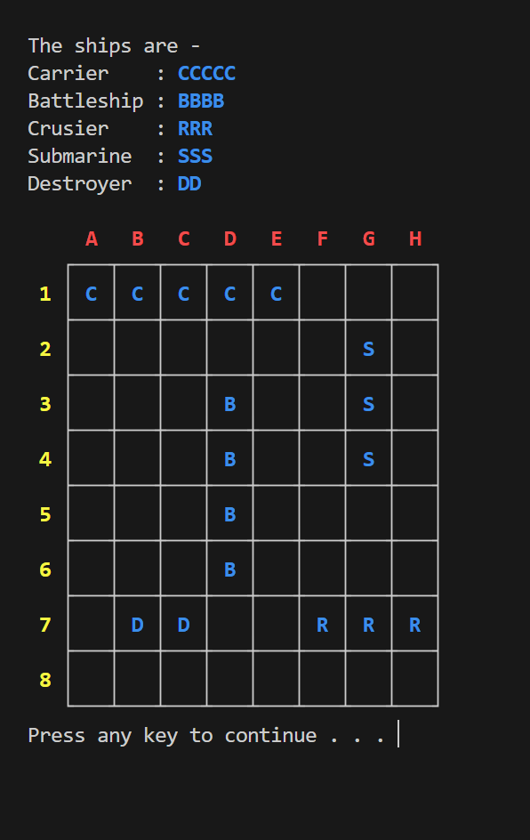
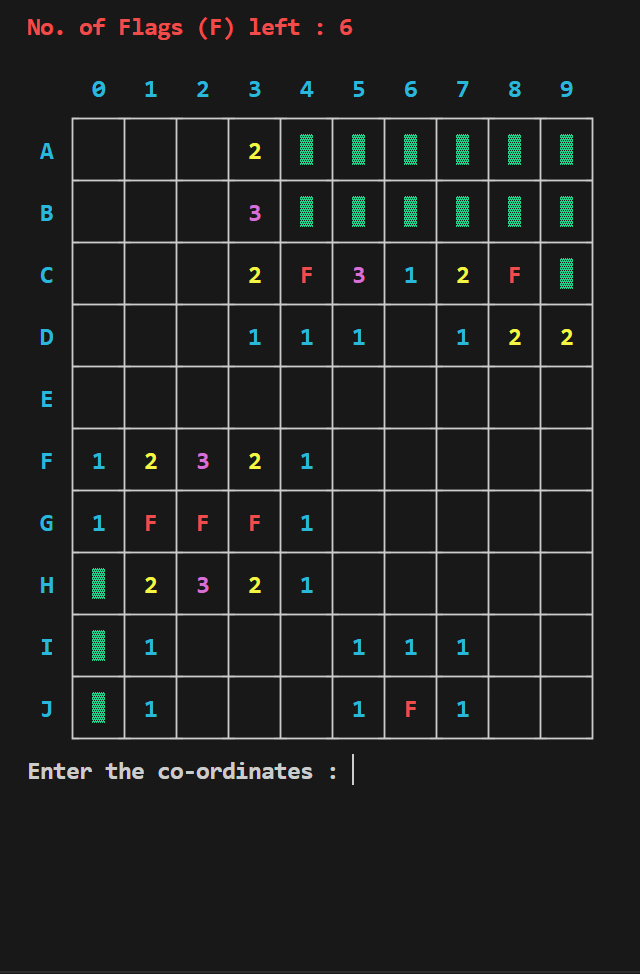
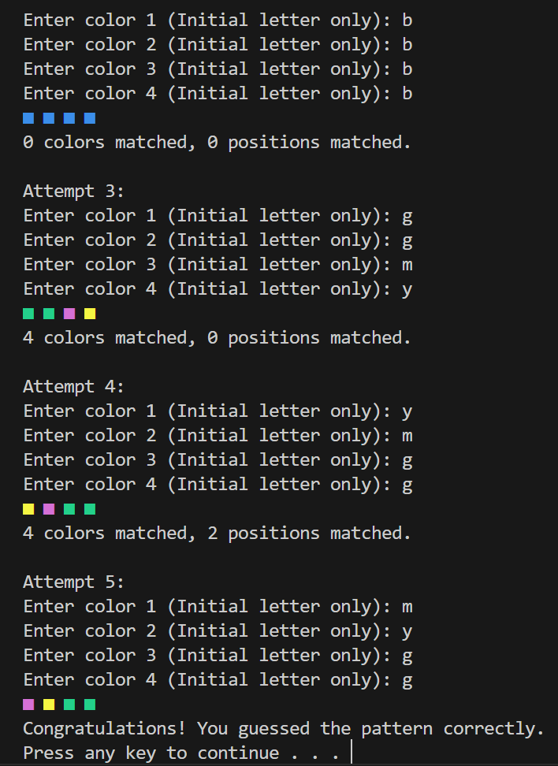
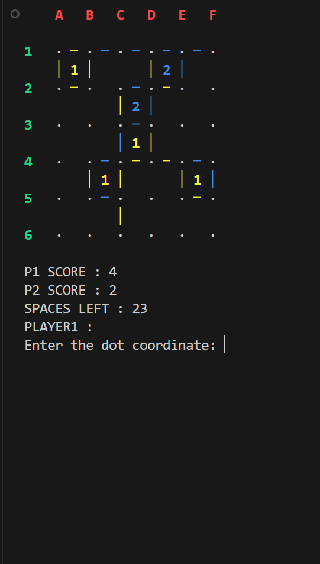

# Gaming Arcade

A neat terminal-based Gaming Arcade built in C, featuring 11 games all in one place.

## Available Games

- 2048
- Battleship
- Bingo
- Chain Reaction
- Connect 4
- Connect Dots
- Hand Cricket
- Hues and Cues
- Minesweeper
- Rock Paper Scissors
- Tic Tac Toe

## Program Execution

1. Clone the repository.
 
2. Use the following command to compile the code :
   
   ```bash
   gcc Main.c -o Main.exe
   ```

3. Run the executable file using the following command :

   ```bash
   ./Main.exe
   ```

4. All the rules of the games can be viewed from within the gaming arcade itself.
   
## Snapshots

<p align="center">
  
  
</p>    

<p align="center">
  
  
</p>

## Contributors

- Ravilisetty Makarandh ([@rmak05](https://github.com/rmak05))
   - Battleship
   - Chain Reaction

- Suprit Naik ([@SNprime24](https://github.com/SNprime24))
   - 2048
   - Connect 4
   - Minesweeper

- Om Prakash Behera ([@notCliche](https://github.com/notCliche))
   - Hand Cricket
   - Hues and Cues
   - Rock Paper Scissors

- Harsh Maurya ([@pntu007](https://github.com/pntu007))
   - Bingo
   - Connect Dots
   - Tic Tac Toe